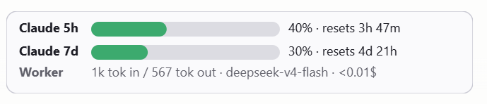

# Claude Coworker + Token Monitor (Windows 11)



A Windows 11 fork of [imkunal007219/claude-coworker-model](https://github.com/imkunal007219/claude-coworker-model) that **offloads bulk I/O from Claude Code to a cheap LLM** (DeepSeek / Kimi / local Ollama) — plus a **taskbar token monitor** that shows live Claude 5h/7d quota usage and worker spend side by side.

[](https://opensource.org/licenses/MIT)


Differences from upstream:
- Windows-only (`setup.ps1`, `.cmd` shims, UTF-8 stdout fix for cp1252).
- Provider profiles in `config.py` instead of `WORKER_*` environment variables.
- DeepSeek V4 Flash/Pro alongside Kimi and Ollama; DeepSeek V4 Flash as default.
- **New:** `monitor/` — a PySide6 tray + taskbar widget showing live Claude / worker token usage.

For Linux/macOS, use the upstream repo.

## Quick Start (Windows 11)

Run from a normal PowerShell window:

```powershell
git clone https://github.com/streetviewtechnologyai/cheap-claude-coworker-windows.git
cd cheap-claude-coworker-windows
powershell -ExecutionPolicy Bypass -File .\setup.ps1
```

`setup.ps1` creates an isolated venv at `%LOCALAPPDATA%\claude-coworker\venv`, installs `openai` + `PySide6` + `requests`, and drops `.cmd` shims (`ask`, `write`, `extract-chat`, `coworker-config`, `token-monitor`) into `%USERPROFILE%\.local\bin` (added to your User PATH if missing).

Then create your local config from the template and paste your API key into it:

```powershell
copy config.py.template config.py
git update-index --skip-worktree config.py   # so your keys never get committed
notepad config.py
```

`config.py` is tracked in the repo with empty keys; the `skip-worktree` flag tells git to ignore your local edits to it. Undo later with `git update-index --no-skip-worktree config.py`.

Test the worker:
```powershell
coworker-config show
ask --paths setup.ps1 --question "what does this script do?"
```

Launch the token monitor:
```powershell
token-monitor
```

To launch automatically at sign-in:
```powershell
powershell -ExecutionPolicy Bypass -File .\install\install_startup.ps1
```
or right-click the tray icon → **Start with Windows**.

## CLAUDE.md Setup

Needed to make Claude Code Desktop use this automatically.

For ALL projects:
Add the content of the `CLAUDE.md.template` file to your main `CLAUDE.md` file so Claude Code loads it automatically on startup.

Per project:
Copy the content of the `CLAUDE.md.template` file to your `CLAUDE.md` file at the project root. If you don't want it automatically for each project, or want different workers for different projects.

## How the worker works

The expensive model (Claude) handles reasoning and architecture. The cheap worker model handles token-heavy I/O:

1. **Read**: Worker ingests large codebases, returns structured summaries with file paths and line numbers
2. **Generate**: Worker produces boilerplate using existing files as style references
3. **Extract**: Worker parses session transcripts for documentation

Pattern: Claude decides *what* to do; the worker does the *reading/writing*.

## Token Monitor

The widget pinned to the taskbar (screenshot above) shows three rows:

- **Claude 5h** — your 5-hour quota window utilization, fetched live from Anthropic. Matches what Claude Code Desktop displays in its own footer.
- **Claude 7d** — the 7-day rolling window, same source.
- **Worker** — total session in/out tokens, active provider, and computed dollar spend at list-price rates (`<0.01$` for sub-cent amounts, `free (local)` for localhost-Ollama).

A tray icon shows an abbreviated session token count (`12k`, `1.2M`) with the badge color stepping green → amber → red as 5h utilization rises.

### How quota numbers are sourced

`monitor/sources/claude_quota.py`:
1. Reads the OAuth bearer from Claude Code CLI's plain-text `~/.claude/.credentials.json` if present.
2. Otherwise decrypts Claude Code Desktop's bearer from `%APPDATA%\Claude\config.json` (Electron safeStorage: AES-256-GCM with a DPAPI-wrapped key).
3. Tries `GET https://api.anthropic.com/api/oauth/usage` first.
4. Falls back to a 1-token `POST /v1/messages` and reads `anthropic-ratelimit-unified-{5h,7d}-utilization` response headers (the same channel Claude Code Desktop uses).

Polling is throttled to once per 5 minutes so it doesn't burn meaningful tokens.

### Worker spend

`tools/ask` and `tools/write` log every API response to `~/.claude/coworker-tokens.jsonl`:

```json
{"ts":"2026-05-08T14:30:00Z","tool":"ask","provider":"deepseek-v4-flash",
 "model":"deepseek-v4-flash","base_url":"https://api.deepseek.com",
 "prompt_tokens":1234,"completion_tokens":567,"cached_tokens":0,
 "finish_reason":"stop","ppid":21088}
```

`monitor/pricing.py` multiplies by published per-million rates (DeepSeek, Kimi). Localhost base URLs are treated as free; providers with no rate in the table show `—` rather than fake a number.

Disable per-call logging with `WORKER_LOG_TOKENS=0` before invoking `ask`/`write`.

### Tray menu

Right-click the tray icon for:
- **Refresh now** / **Update frequency** (1 / 5 / 15 s)
- **Reset session counter** / **Reset widget position**
- **Open coworker log**
- **Pause polling**
- **Show only with Claude focused** (default on — widget hides when other apps are active. True shell surfaces — taskbar, tray flyout, desktop, Start menu — are transparent, so clicking the tray chevron with Claude focused doesn't flicker the widget. File Explorer folder windows are detected by window class (`CabinetWClass`) and treated as regular apps, so alt-tabbing to a folder hides the widget.)
- **Plan** — Pro / Max 5× / Max 20× / Teams / Enterprise / API. Subscription plans hide the per-token list-price total since it's not what you actually pay; tooltip still shows the API-equivalent.
- **Theme** — System (default, follows Windows) / Light / Dark
- **Start with Windows** / **Quit**

## Configuration — `config.py`

Provider profiles live in [config.py](config.py). Default active provider is **DeepSeek V4 Flash**.

```bash
coworker-config list                  # show all providers and the active one
coworker-config show                  # show the resolved active config
coworker-config use deepseek-v4-pro   # switch active provider
coworker-config use kimi
coworker-config use ollama
```

Built-in profiles:

| Name                | Provider                      | Model                |
|---------------------|-------------------------------|----------------------|
| `deepseek-v4-flash` | DeepSeek V4 Flash *(default)* | `deepseek-v4-flash`  |
| `deepseek-v4-pro`   | DeepSeek V4 Pro               | `deepseek-v4-pro`    |
| `kimi`              | Kimi (Moonshot AI)            | `kimi-k2.5`          |
| `ollama`            | Ollama (local)                | `qwen2.5-coder:14b`  |

API keys are stored in the `api_key` field of each provider in [config.py](config.py) (created from [config.py.template](config.py.template) on first install). Paste your key in directly — no env vars required.

### Adding a new provider

Edit [config.py](config.py) and add an entry to `PROVIDERS`:

```python
"my-provider": {
    "label": "My Provider",
    "base_url": "https://api.example.com/v1",
    "model": "some-model",
    "api_key": "sk-...",
},
```

Any OpenAI-compatible endpoint works.

## Tools

### ask — bulk reading
Delegate bulk reading to the worker model. Returns structured bullets, not prose.

```bash
ask \
  --paths auth.py database.py utils.py \
  --question "Identify all unvalidated inputs" \
  --max-tokens 8192
```

Flags:
- `--paths`: Files to ingest
- `--question`: Specific extraction query
- `--max-tokens`: Total budget including reasoning tokens (default 8192)
- `--provider`: Override active provider for this call
- `--model`: Override model id

### write — boilerplate generation
Generate code or documentation using an existing file as a style reference.

```bash
write \
  --spec "Write pytest tests for auth.py covering OAuth2 flow" \
  --context tests/test_main.py \
  --target tests/test_auth.py
```

Flags:
- `--spec`: What to write
- `--context`: Reference file to mimic (style, imports, structure)
- `--target`: Output file path
- `--max-tokens`: Token budget for reasoning + output (default 16384)
- `--provider`, `--model`: Same as `ask`

### extract-chat — chat transcript extraction
Convert Claude Code JSONL session logs to human-readable text. Stdlib only — works regardless of which provider is active.

```bash
# Extract last session to stdout
extract-chat ~/.claude/projects/my-project/session.jsonl

# Write to file
extract-chat session.jsonl -o chat.txt

# Pipe to ask for doc updates
extract-chat session.jsonl -o chat.txt && \
  ask --paths chat.txt docs/README.md --question "What doc updates are needed?"
```

### coworker-config — switch providers
Already covered above. Subcommands: `list`, `show`, `use <name>`.

### token-monitor — taskbar token widget
Launches the tray app from the coworker venv. Closes via tray-icon → Quit.

## Windows 11 + Claude Code Desktop notes

- The Windows installer puts `.cmd` shims in `%USERPROFILE%\.local\bin` and adds that folder to your User PATH if needed. Open a **new** terminal after first install for PATH changes to take effect.
- The venv lives at `%LOCALAPPDATA%\claude-coworker\venv`.
- Run setup from a normal PowerShell window. Don't run `setup.ps1` from inside Claude Code Desktop — its sandbox redirects `%LOCALAPPDATA%` so the venv lands in a hidden per-app folder regular shells can't see.
- The token monitor settings live at `HKCU\Software\panohopper\TokenMonitor`.

## Results

| Metric                  | Before                | After                 |
|-------------------------|----------------------|-----------------------|
| Claude Pro weekly limit | Hit by Wednesday     | Never hit             |
| Token usage per session | 80%+ on file reading | 20% (summaries only)  |
| 3-week worker API cost  | —                    | $0.38 total           |
| Context window usage    | 80% reading files    | 20% reading summaries |

Based on the pattern described in [this implementation (medium link)](https://medium.com/@kunalbhardwaj598/i-was-burning-through-claude-codes-weekly-limit-in-3-days-here-s-how-i-fixed-it-0344c555abda) [Reddit link](https://www.reddit.com/r/ClaudeAI/comments/1t1o43w/i_gave_claude_code_a_002call_coworker_and_stopped/) (567K views Reddit, 7.2K Medium).

## Author

Original:
**Kunal Bhardwaj** — Systems engineer working on autonomous drones and AI-powered developer tools. Building at the intersection of embedded systems and LLM workflows.

- Blog: [medium.com/@kunalbhardwaj](https://medium.com/@kunalbhardwaj598/i-was-burning-through-claude-codes-weekly-limit-in-3-days-here-s-how-i-fixed-it-0344c555abda)
- LinkedIn: [linkedin.com/in/kunalbhardwaj](https://www.linkedin.com/in/kunal-bhardwaj-61433818b)

Windows 11 fork + Token Monitor:
**Jan Mantkowski** — Project Manager working on Windows apps for panoramic streetview footage recorded by 360 cameras.

- Website: https://www.360camsters.com

## Credits

The token monitor's quota-fetch flow (Claude Desktop credential decode + `/v1/messages` rate-limit-header fallback) is modelled on [CodeZeno/Claude-Code-Usage-Monitor](https://github.com/CodeZeno/Claude-Code-Usage-Monitor) (MIT, Rust).

## Contributing

PRs welcome. Focus areas: additional provider templates, monitor caps for new plan tiers, and extracting structured data from more session formats.

MIT License. See [LICENSE](LICENSE).
